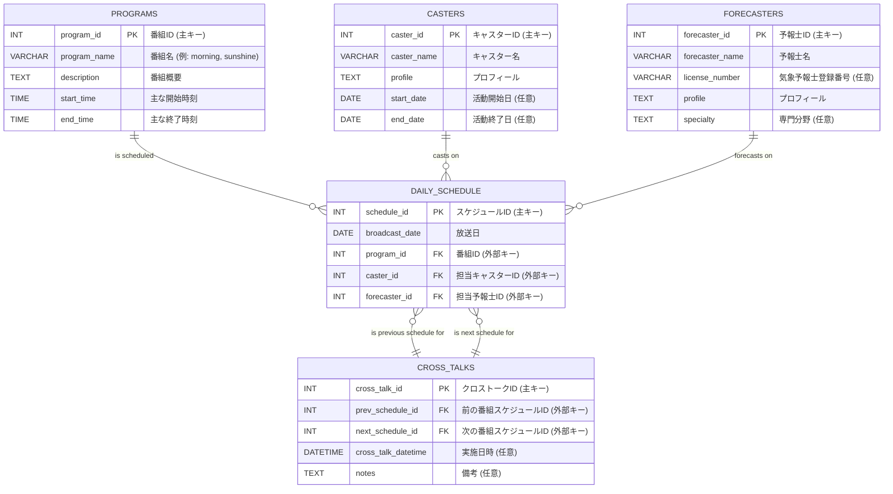

```mermaid
erDiagram
    PROGRAMS {
        INT program_id PK "番組ID (主キー)"
        VARCHAR program_name "番組名 (例: morning, sunshine)"
        TEXT description "番組概要"
        TIME start_time "主な開始時刻"
        TIME end_time "主な終了時刻"
    }

    CASTERS {
        INT caster_id PK "キャスターID (主キー)"
        VARCHAR caster_name "キャスター名"
        TEXT profile "プロフィール"
        DATE start_date "活動開始日 (任意)"
        DATE end_date "活動終了日 (任意)"
    }

    FORECASTERS {
        INT forecaster_id PK "予報士ID (主キー)"
        VARCHAR forecaster_name "予報士名"
        VARCHAR license_number "気象予報士登録番号 (任意)"
        TEXT profile "プロフィール"
        TEXT specialty "専門分野 (任意)"
    }

    DAILY_SCHEDULE {
        INT schedule_id PK "スケジュールID (主キー)"
        DATE broadcast_date "放送日"
        INT program_id FK "番組ID (外部キー)"
        INT caster_id FK "担当キャスターID (外部キー)"
        INT forecaster_id FK "担当予報士ID (外部キー)"
    }

    CROSS_TALKS {
        INT cross_talk_id PK "クロストークID (主キー)"
        INT prev_schedule_id FK "前の番組スケジュールID (外部キー)"
        INT next_schedule_id FK "次の番組スケジュールID (外部キー)"
        DATETIME cross_talk_datetime "実施日時 (任意)"
        TEXT notes "備考 (任意)"
    }

    PROGRAMS ||--o{ DAILY_SCHEDULE : "is scheduled"
    CASTERS ||--o{ DAILY_SCHEDULE : "casts on"
    FORECASTERS ||--o{ DAILY_SCHEDULE : "forecasts on"

    %% --- クロストーク関連のリレーションシップ ---
    %% ある日のスケジュールは、次の番組とのクロストークを持つ場合がある (0 or 1)
    DAILY_SCHEDULE }o--|| CROSS_TALKS : "is previous schedule for"
    %% ある日のスケジュールは、前の番組とのクロストークを持つ場合がある (0 or 1)
    DAILY_SCHEDULE }o--|| CROSS_TALKS : "is next schedule for"
```